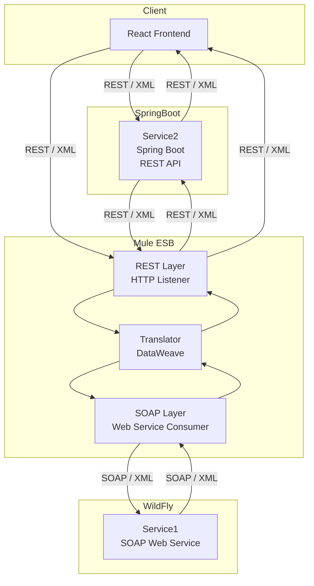
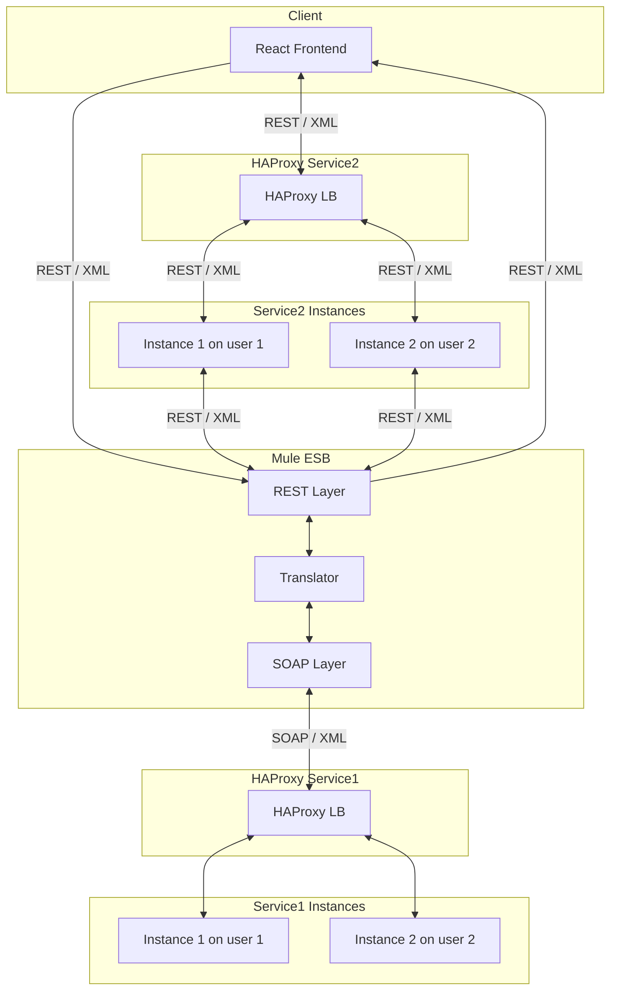

1. SOA Lab4 should be developped base on Lab2(Not based on Lab3!)
2. Need 2-3 helios account of student on helios to deploy Lab4
3. For each account deploy 1 instance of Service1 and Service2, make sure different service instance use different resources and different database on helios
4. Change Service1 from Restful to SOAP, Service2 just keep on Restful
5. Use Mule ESB to integrate 2 service together
6. Realize an additional Rest Layer(on Mule ESB, don't need to create another Rest API Service), so that I don't need to change the client (Service 2) to access to Service 1, the Rest Layer should not contain any logic besides calling SOAP Services 



Now ther should be two way for React Frontend to call Service1 and Service2:

1. React Frontend <-rest-> Service2 <-rest-> Mule <-soap-> Service1
2. React Frontend <-rest-> Mule <-soap-> Service1



```xml
                <datasource jndi-name="java:/jdbc/Lab2DS" pool-name="Lab2DS">
                    <connection-url>jdbc:postgresql://localhost:5432/studs</connection-url>
                    <driver-class>org.postgresql.Driver</driver-class>
                    <driver>org.postgresql</driver>
                    <security>
                        <user-name>postgres</user-name>
                        <password>123456</password>
                    </security>
                    <validation>
                        <valid-connection-checker class-name="org.jboss.jca.adapters.jdbc.extensions.postgres.PostgreSQLValidConnectionChecker"/>
                        <validate-on-match>true</validate-on-match>
                        <exception-sorter class-name="org.jboss.jca.adapters.jdbc.extensions.postgres.PostgreSQLExceptionSorter"/>
                    </validation>
                </datasource>
```